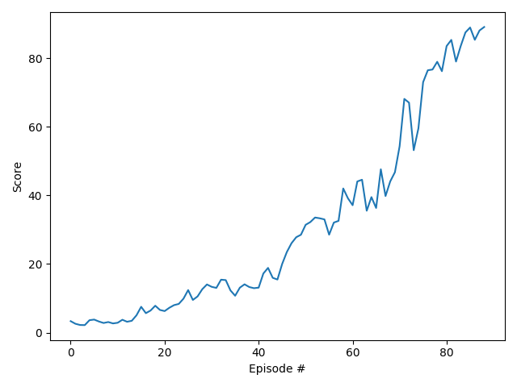

# Report: Navigation project

Implementations of both DDPG and PPO were written to solve this problem; PPO and DDPG. However I was unable to get the 
PPO implementation working properly; during training the average score was stuck at around 0.4 
and was not increasing at all. On the other hand with DDPG I was able to solve the environment and get good performance, so only
the DDPG implementation is discussed in the rest of this report.

## Implementation
### Unity environment and reward scaling 
The unity environment was wrapped as an OpenAI gym environment, so it could be easily transferred between different
RL algorithms. Specifically it was wrapped as a gym `VectorEnv` environment, which is an extension of the normal `gym.Env`
designed for parallel environments that represent multiple environments at once, eg. they take a stacked vector of actions and 
return. This obviously corresponds to this Unity environment, since it runs 20 agents at once.

#### Reward scaling
I found that the rewards returned from the environment were not the same as in the project description, eg. 
_"a reward of +0.1 is provided for each step that the agent's hand is in the goal location"_, instead they were floating
point numbers that were often smaller than 0.1. To remedy this I changed the rewards so that if the reward for an agent was greater 
than zero at all then the reward was set to 1.0, and 0.0 otherwise.

These rewards were set to 1.0 as this was the only way I could get the DDPG algorithm to train successfully, even though
according to the project description these rewards should have been 0.1. To account for this when reporting the average scores
for each episode I divided the mean rewards for the episode by a factor of 10.0, which should be equivalent to receiving
a reward of 0.1.

### DDPG Implementation
This implementation was based off the benchmark implementation from the project description, including features intended 
to improve training stability such as gradient clipping, as well as only performing the network update step 10 times after every 20 timesteps. 
In order to do this I created separated functions `store_experience()` and `update_networks()`, the first of which adds 
the agents experience data to the ReplayBuffer and the second updates both the actor and critic networks. This means that experience 
for all agents can be added at each timestep, but the networks updated less frequently. The period between network updates and
the number of network updates to perform were parameterised so these can be treated as hyperparameters (see hyperparameters section below).

There are also some differences from the benchmark implementation, for example I did not add the Ornstein-Uhlenbeck process noise,
as I found that training did not work when this noise was added (the score did not improve at all). 

I also made some changes to the neural net architectures for actors and critics, see next section.

#### Neural Net Architecture
The neural net architectures for both actor and critic, as well as the training hyperparameters, were similar
to the example implementations of DDPG. However I used `tanh` activations everywhere instead of `ReLU`.

##### Actor
The actor network is a simple MLP (multi-layer perceptron) architecture with two hidden linear layers of size 400 and 300.
The actor network uses the default PyTorch initialisation for the values of the weights, rather than explicitly initialising
the weights, this was found to improve performance.

It uses `tanh` activations after every layer, including the output (which conveniently keeps the actions between -1 and 1).

##### Critic
The critic network is also a simple MLP architecture but with three hidden layers, the first layer is size 400, the second
layer is a concatenation of the first layer output and the action values, and the third layer has 300 linear units.
The actor network uses the default PyTorch initialisation for the values of the weights, rather than explicitly initialising
the weights, this was found to improve performance.

It uses `tanh` activations after every layer, apart from the output layer which has no activation function.

## Training 
The training was stopped when the average reward for the last 100 episodes was greater than the 
`reward_threshold` of 30.0, which seemed to correspond to good performance on the task. When the average score achieved this threshold the 
training is automatically halted, and the final weights of the neural networks are written to a file. 
Additionally the current weights of the local network were periodically stored to a checkpoint file, in order to 
have a record of the weights during training. 

The "Adam" optimizer was used for each neural network (actor and critic), however with separate values of learning rate
and L2 weight decay (see hyperparameters section for details).

#### Hyper-parameters
The following table lists all the relevant hyperparameters for the DDPG implementation. The values below were found to give good 
performance, and these were used for the final run which generated the results in the next section (the score plot and gif):

Hyperparameter | Description | Value
--- | --- | ---
gamma | Discount factor | 0.99 
network_update_period | how often to update actor and critic networks (in timesteps) | 20
num_network_updates | how many times to update actor and critic networks | 10
buffer_size | replay buffer size | 1e6
batch_size | minibatch size | 128 
tau | rate of mixing for soft update of target parameters | 1e-3
learning_rate_actor | ADAM learning rate for actor network | 1e-4 
learning_rate_critic | ADAM learning rate for critic network | 2e-4 
critic_weight_decay | L2 weight decay for critic network | 0.0001  

### Results
The target score of 30.0, averaged over 100 timesteps and all 20 agents, was reached in less than **90 episodes**. The 
score seemed to continue to increase throughout the training run, reaching above 80. This also seemed to translate into
subjectively good performance on the task, as you can see from the recorded gif, which is a recording of the agent using
the final trained weights. It can be observed that the arms are able to remain in the target area for almost all of the
time, and they quickly recover if they move outside the target.

### Ideas for future work
This project achieved good performance and fast training using DDPG, however there are many further avenues for exploration.
I was surprised that adding noise seemed to hurt training performance, so it would definitely be worthwhile to investigate this
further and see if adding noise could be used to speed up training. 

I didn't spend that much time tuning the hyperparameters for DDPG, as I spent most of that time trying to tune the hyperparameters
for PPO to get it to work, so it would be useful to try even more hyperparameter options for DDPG, perhaps using a
black box optimisation algorithm like bayesian optimisation to automate this process.

There is plenty of things to try out with the neural networks for DDPG, for example experimenting with different sizes and number of
layers. It would also be interesting to perform some more rigorous experiments on whether `tanh` or `ReLu` activations perform best.

It would be good to investigate why the PPO implementation is not working, I already spent quite a lot of time debugging it
but I couldn't get to the bottom of the issue, it's perhaps a simple bug somewhere.

Also now that the environment is wrapped as an OpenAI gym object, it would be relatively easy to try this out with many other RL algorithms
in order to see which ones perform best, for example A3C or A2C, of which there are many open source implementations online which conform
to the gym interface. 