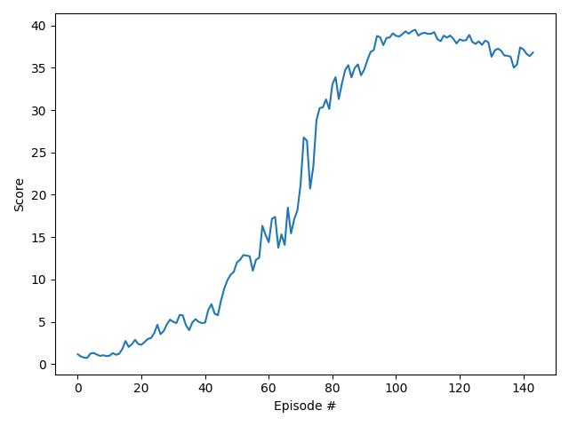

# Report: Navigation project

Implementations of both DDPG and PPO were written to solve this problem, they are discussed separately below.

## Implementation details
The unity environment was wrapped as an OpenAI gym environment, so it could be easily transferred between different
RL algorithms. Specifically it was wrapped as a gym `VectorEnv` environment 

## DDPG
This was based off the benchmark implementation from the project description, including many features such

### Neural Net Architecture

The neural net architectures for both actor and critic, as well as the training hyperparameters, were similar
to the example implementations of DDPG. However I used `tanh` activations everywhere instead of `ReLu`
#### Actor

#### Critic

#### Training details
The training was stopped when the average reward for the last 100 episodes was greater than the `reward_threshold` of 
15.0, which seemed to correspond to good performance on the task. When the average score achieved this threshold the 
training is automatically halted, and the final weights of the neural networks are written to a file. 
Additionally every 200 episodes the current weights of the local network are stored to a checkpoint file, in order to 
have a record of the weights during training. 

The "Adam" algorithm was used for stochastic gradient descent, with a learning rate of 8e-4.

#### Hyper-parameters
Different values of the following hyper-parameters were experimented with. The values below were found to give good 
performance, and these were used for the final run which generated the results in the next section (the score plot and gif):

Hyperparameter | Description | Value
--- | --- | ---
gamma | Discount Rate | 
1 | 2 | 3

- gamma = 0.99  (discount rate)
- update_network_interval = 4 (how often to update the network)
- eps_end = 0.01 (final epsilon value)
- eps_decay = 0.0997 (epsilon decay)
- learning_rate = 8e-4 (learning rate for stochastic gradient descent)

### Results
The target average score of 30.0 was reached in **480 episodes**.

### Ideas for future work
This project achieved decent performance with just a vanilla DQN algorithm, however there are many ways that this 
performance could potentially be improved. Some ideas are given below:

1. Try other algorithms, now that the environment is wrapped as a gym env...

3. Improved hyper-parameter tuning: the current hyperparameter values were found by manually trying different values,
 however an automatic hyper-parameter optimization process may be able to find better performing values, for example a 
 black box optimization algorithm such as bayesian optimization.